# Customer Shopping Behavior Analysis

## 📌 Project Overview
A leading retail company aims to better understand its customers' shopping behavior to improve sales, customer satisfaction, and long-term loyalty. This project analyzes a dataset of **3,900 purchases** to uncover patterns across demographics, product categories, and sales channels.

The goal is to answer: *"How can the company leverage consumer shopping data to identify trends, improve customer engagement, and optimize marketing strategies?"*

## 📂 Deliverables
1.  **Data Preparation (Python):** Cleaning and transforming raw data.
2.  **Database Management (PostgreSQL):** Storing structured data and running complex queries.
3.  **Data Analysis (SQL):** Extracting insights on customer segments, revenue, and trends.
4.  **Dashboard (Power BI):** Visualizing key metrics for stakeholders.

---

## 🛠️ Technologies Used
* **Python:** Pandas, NumPy, SQLAlchemy (for Data Cleaning & Database Connection)
* **SQL (PostgreSQL):** Data Analysis & Querying
* **Power BI:** Data Visualization & Dashboarding
* **CSV:** Raw Data Source

---

## 🚀 Step 1: Exploratory Data Analysis & Data Preparation (Python) & Python Connection

Before diving into SQL analysis, we used Python (Pandas) to clean, validate, and structure the raw data. This ensured the insights generated later were accurate and consistent.

* **📥 Data Loading:**

    * Utilized the ```pandas``` library to ingest the raw ```customer_shopping_behavior.csv``` dataset into a DataFrame.

    * Verified the successful load of all **3,900 records and 18 columns**.

* **🔍 Initial Exploration & Audit:**

    * Ran ```df.info()``` to inspect data types (integers, objects, floats) and identify memory usage.

    * Executed ```df.describe()``` to analyze statistical distributions (mean, min, max) for numerical columns like ```Age``` and ```Purchase Amount```, ensuring values fell within expected ranges.

* **🛠 Missing Data Strategy:**

    * Identified missing values in the ```Review Rating``` column.

    * **Action:** Instead of dropping these rows (which would lose valuable sales data), we performed **imputation**. We **calculated the median review rating for each specific product category** and filled the missing values accordingly. This preserved the integrity of the dataset.

* **abc Column Standardization:**

    * The raw CSV headers contained spaces and mixed casing (e.g., ```Item Purchased```).

    * **Action:** Renamed all columns to ```snake_case``` (e.g., ```item_purchased```, ```purchase_amount```) to make them compatible with PostgreSQL querying standards and easier to type in code.

* **⚙️ Feature Engineering:**

    * **Age Grouping:** Created a new age_group column by binning continuous age values into categories: *Young Adult (<25), Adult (25-40), Middle-Aged (41-60), and Senior (>60)*. This allows for demographic segmentation in the final dashboard.

    * **Frequency Analysis:** Processed purchase data to derive a ```purchase_frequency_days``` metric, helping to identify how often customers return.

* **🧹 Data Consistency Check:**

    * Analyzed the relationship between ```Discount Applied``` and ```Promo Code Used```.

    * **Finding:** These two columns provided redundant information (if a promo code was used, a discount was always applied).

    * **Action:** Dropped the ```promo_code_used``` column to streamline the dataset and reduce redundancy.

* **🔌 Database Integration:**

    * Established a connection to the local PostgreSQL database using ```SQLAlchemy and psycopg2```.

    * Loaded the fully cleaned and transformed DataFrame directly into a SQL table named ```customer```, making it ready for complex querying.


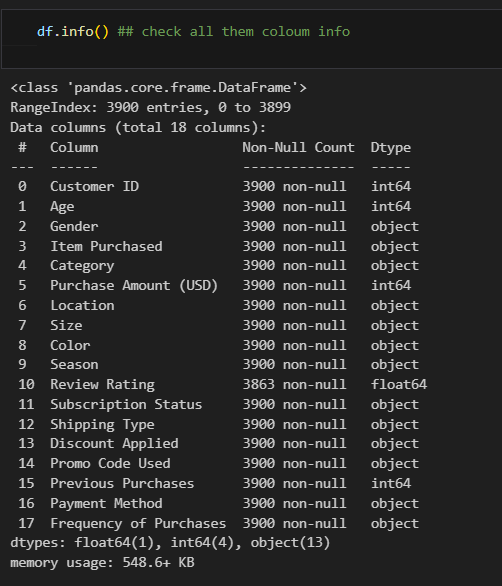
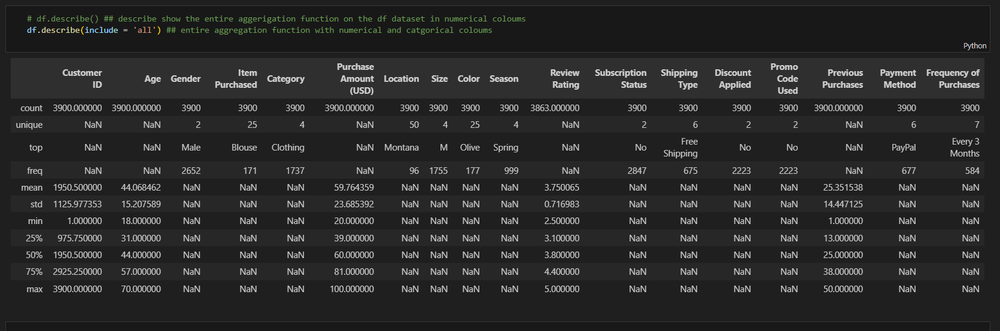
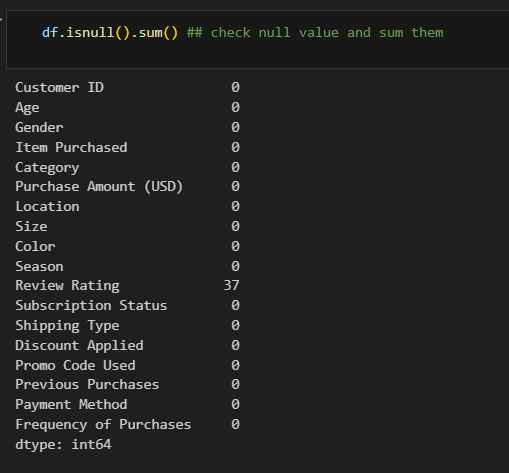

### 🔗 Connecting Python to PostgreSQL
To analyze the data in SQL, we established a connection between our Pandas DataFrame and the Postgres database using the `sqlalchemy` library.

**Definition:**
The `create_engine` function from SQLAlchemy creates a connection object that allows Python to communicate with the database. We then use `df.to_sql()` to push our cleaned dataset directly into a SQL table.

**Packeages need to be download**
```
pip install sqlalchemy psycopg2
# or
uv add sqlalchemy psycopg2 
```

**Code Snippet:**
```python

from sqlalchemy import create_engine
username = "postgres"               ## default user
password = "1234"                   ## installation password
host = "localhost"                  ## if running locally
port = '5432'                       ## local default port number
database = "customer_behavior"      ## the database name that you are going to connect


engine = create_engine(f"postgresql+psycopg2://{username}:{password}@{host}:{port}/{database}")                     # Create the connection engine


## step 2 load dataframe into database/ postgreSQL

table_name = "customer"
df.to_sql(table_name, engine, if_exists = "replace", index = False)

display(f"Data successfully loaded into table {table_name} in database {database}.")
```
👇 Screenshot: Python to PostgreSQL Connection Execution
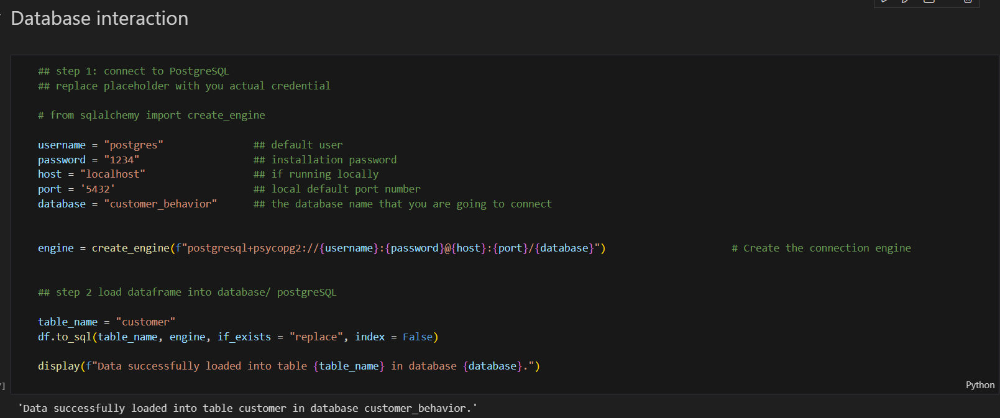


## Step 2: Data Analysis (SQL)
Below are the SQL queries used to solve specific business questions.

**Q1: What is the total revenue generated by male vs female customers?**
Analyzing spending power by gender.
```sql
SELECT gender, SUM(purchase_amount) AS revenue
FROM customer
GROUP BY gender;
```
👇 Output:

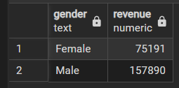

**Q2: Which customers used a discount but still spent more than the average purchase amount?**
Identifying high-value customers who are responsive to discounts.

```sql
SELECT customer_id, discount_applied, purchase_amount
FROM customer
WHERE discount_applied = 'Yes' 
AND purchase_amount > (SELECT AVG(purchase_amount) FROM customer);
```
👇 Output:

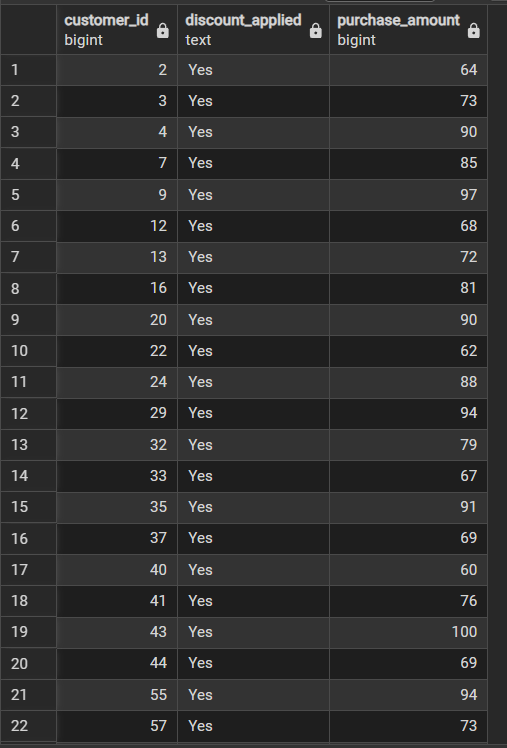


**Q3: What are the top 5 products with the highest average review rating?
Understanding which products satisfy customers the most.**

```sql
SELECT item_purchased, ROUND(AVG(review_rating::numeric),2) AS "Average Product Rating"
FROM customer
GROUP BY item_purchased
ORDER BY AVG(review_rating) DESC
LIMIT 5;
```
👇 Output:

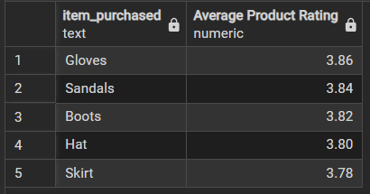

**Q4: Compare the average purchase amounts between Standard and Express shipping.**
Does shipping speed correlate with higher spending?

```sql
SELECT shipping_type, ROUND(AVG(purchase_amount),2) AS "Average Purchase Amount"
FROM customer
WHERE shipping_type IN ('Standard', 'Express')
GROUP BY shipping_type;
```
👇 Output:

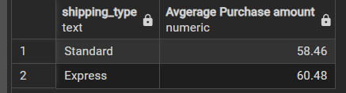

**Q5: Do subscribed customers spend more?**
Comparing average spend and total revenue between subscribers and non-subscribers.

```sql
SELECT COUNT(customer_id) AS "Total Customer", 
       subscription_status, 
       ROUND(AVG(purchase_amount),2) AS avg_spend, 
       SUM(purchase_amount) AS revenue
FROM customer
GROUP BY subscription_status
ORDER BY avg_spend, revenue DESC;
```
👇 Output:

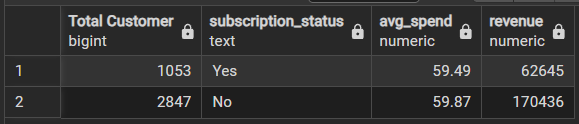

**Q6: Which 5 products have the highest percentage of purchases with a discount applied?**
Identifying products that rely heavily on promotions.

```sql
SELECT item_purchased, 
       ROUND(100 * SUM(CASE WHEN discount_applied = 'Yes' THEN 1 ELSE 0 END) / COUNT(*), 2) AS discount_rate
FROM customer
GROUP BY item_purchased
ORDER BY discount_rate DESC
LIMIT 5;
```
👇 Output:

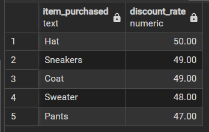

**Q7: Segment customers into New, Returning, and Loyal.**
Segmentation based on the number of previous purchases.

```sql
WITH customer_type AS (
    SELECT customer_id, previous_purchases,
    CASE
        WHEN previous_purchases = 1 THEN 'New'
        WHEN previous_purchases BETWEEN 2 AND 10 THEN 'Returning'
        ELSE 'Loyal'
    END AS customer_segment
    FROM customer
)
SELECT customer_segment, COUNT(*) AS "Number of Customer"
FROM customer_type
GROUP BY customer_segment;
```
👇 Output:

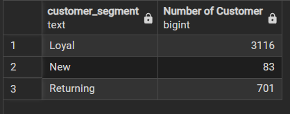

**Q8: What are the top 3 most purchased products within each category?**
Using Window Functions to rank items.

```sql
WITH item_counts AS (
    SELECT category, 
           item_purchased, 
           COUNT(customer_id) AS total_order,
           ROW_NUMBER() OVER(PARTITION BY category ORDER BY COUNT(customer_id) DESC) AS item_rank
    FROM customer
    GROUP BY category, item_purchased
)
SELECT item_rank, category, item_purchased, total_order
FROM item_counts
WHERE item_rank <= 3;
```
👇 Output:

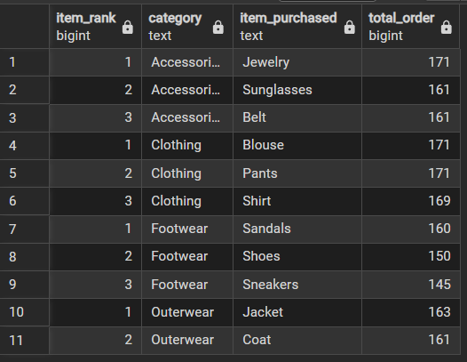

**Q9: Are repeat buyers (more than 5 previous purchases) more likely to subscribe?**
Checking the correlation between loyalty and subscription status.

```sql
SELECT subscription_status, 
       COUNT(customer_id) AS repeat_buyers
FROM customer
WHERE previous_purchases > 5
GROUP BY subscription_status;
```
👇 Output:

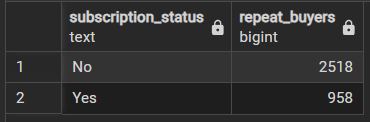

**Q10: Revenue by Age Group.**
Calculated total revenue contribution of each demographic bucket.

```sql
SELECT 
    CASE 
        WHEN age < 25 THEN 'Young Adult'
        WHEN age BETWEEN 25 AND 40 THEN 'Adult'
        WHEN age BETWEEN 41 AND 60 THEN 'Middle-aged'
        ELSE 'Senior' 
    END AS age_group,
    SUM(purchase_amount) AS total_revenue
FROM customer
GROUP BY 1
ORDER BY total_revenue DESC;
```
👇 Output:

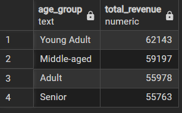


## 📈 Step 3: Power BI Dashboard Guide

The dashboard provides an interactive view of the analysis. Below is the step-by-step process used to build it.

**👇 Dashboard Preview:**

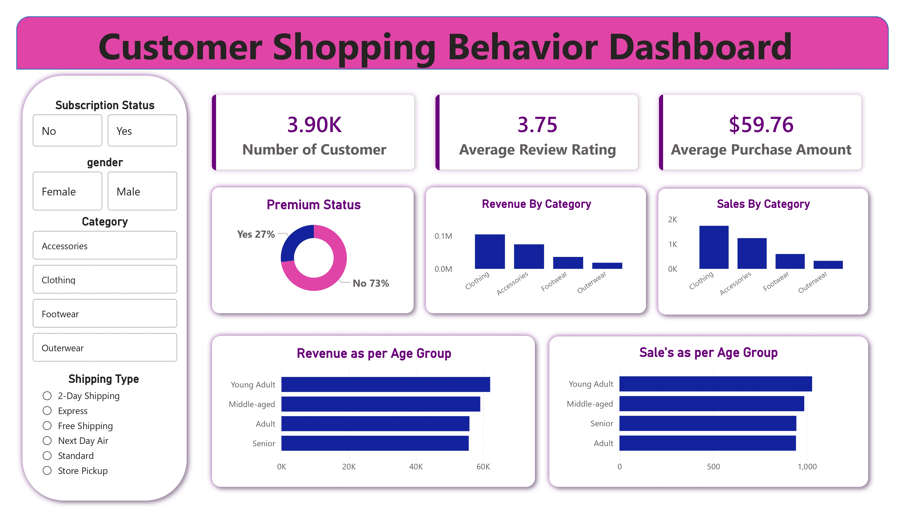

**Step-by-Step Creation Guide:**
* **Import Data:**

    * Opened Power BI Desktop.

    * Selected Ge **Data > Text/CSV** and loaded ```customer_shopping_behavior.csv```.

* **Data Transformation (Power Query):**

    * Checked for null values in the ```Review Rating``` column.

    * Ensured data types were correct (e.g., ```Purchase Amount``` as Currency, ```Age``` as Whole Number).

    * Created a new conditional column for **Age Groups** (Young Adult, Adult, Middle-Aged, Senior) to match the SQL analysis.

* **Building Key Measures (DAX):**

    * Created measures for Total Customers, Average Purchase Amount, and Average Rating.

* **Creating Visuals:**

    * **KPI Cards:** Added top-row cards for quick insights (Total Customers: 3.9K, Avg Purchase: $59.76).

    * **Donut Chart:** Used to visualize **Subscription Status** (Yes vs. No) showing 73% non-subscribers.

    * **Bar Charts:**

        * **Revenue by Category:** Shows Clothing is the highest earning category.

        * **Sales by Age Group:** Highlights that "Adults" and "Young Adults" drive sales.

    * **Slicers/Filters:** Added slicers for **Gender**, **Category**, and **Shipping Type** to allow users to filter the data dynamically.

* **Formatting & Design:**

    * Applied a consistent color theme (Blue/Gold/Grey).

    * Aligned charts using the Grid layout.

    * Added the project title and borders for a clean UI.


## 💡 Key Business Insights
1. **Subscription Opportunity:** Only **27%** of customers are subscribers. Repeat buyers are a prime target for subscription upsells.

2. **Demographics:** The "Adult" and "Middle-aged" groups contribute the most revenue.

3. **Product Trends:** "Clothing" is the dominant category, while specific items like "Jewelry" and "Pants" are top sellers within their categories.

4. **Discount Efficiency:** High-value customers still use discounts; targeted promotions could increase basket size further.

## 📞 Contact
Author: **Ritesh Brahmachari**